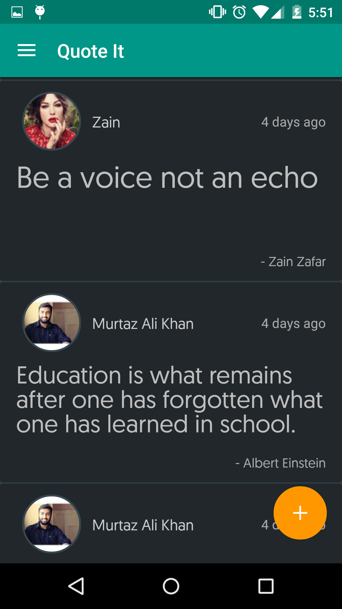
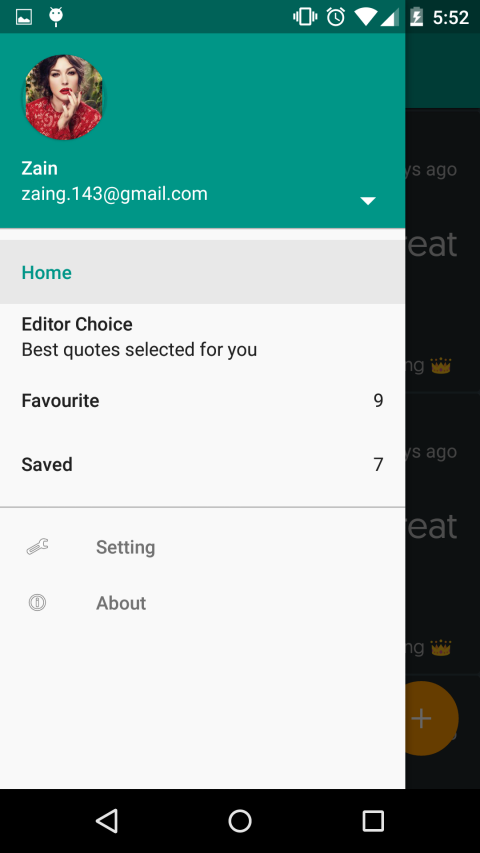
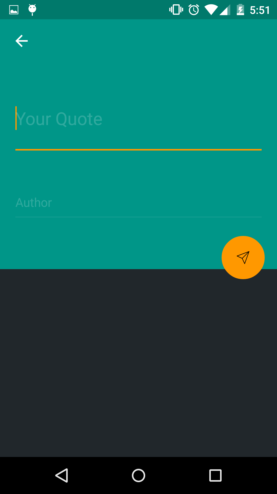
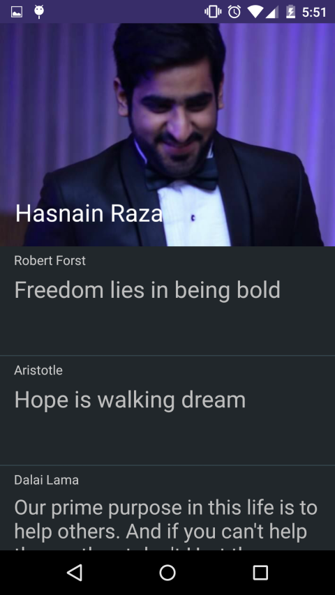
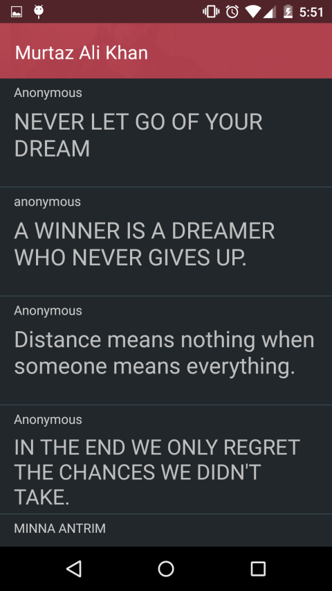

**Quote It Android** 
===================

Quote it is a social platform for sharing quotes and wise sayings. It is great to share and spread the wisdom and thought full.
----------

Screen Shots
-------------------

Features
-------------
**Quote it** is under development at the moment. I am working hard to bring it to general audience as soon as possible. If you are interested in this app then feel free to `fork` this repo. 

> **Current features:**

> - Users Login through Facebook
> - A list of all the quotes created by users.
>- Posting a new quote.
>- Viewing profile of other users along their all quotes

There are number of features which are missing from this app right now. But I have short listed few of them. I will encourage other developers to help me completing this app.  

--------

###Copyright (C) ZaingZ - All Rights Reserved
#####Written by Zain Bin Zafar <zaing.143@gmail.com>, June 2015
-----
